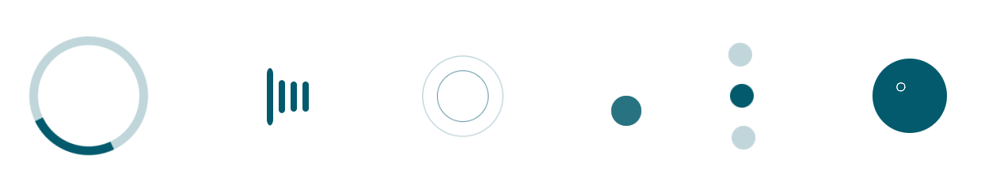

# @codehat/vue-css-loader

> CSS Loader component for `Vuejs` which includes 7 CSS loading animations. The CSS works were adapted from CodePen artists

[](https://www.npmjs.com/package/@codehat/vue-css-loader) [](https://standardjs.com)

## Install

```bash
npm install --save @codehat/vue-css-loader
```

## Usage

```
<template>
  <div class="home">
    <vue-css-loader/>
  </div>
</template>

<script>
// @ is an alias to /src
import VueCssLoader  from '@codehat/vue-css-loader'
export default {
  name: "Home",
  components: {
    VueCssLoader
  },

```

## Props

Using the `type prop` you can activate the following loaders.


- Circles
- BouncingBar
- Wave
- Dots
- TwinCircles
- SpinnerDots
- Focus


## License

MIT © [manojap](https://github.com/manojap)
